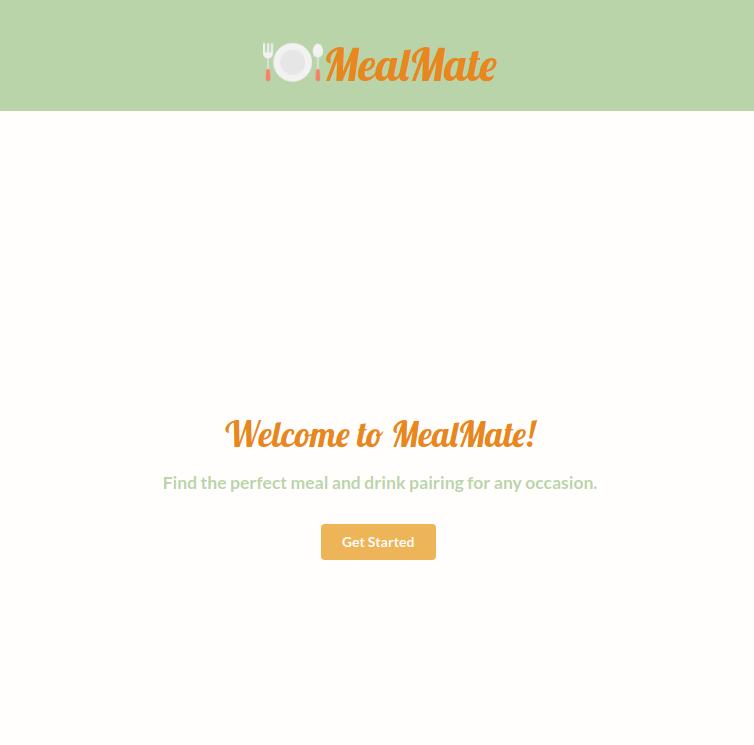
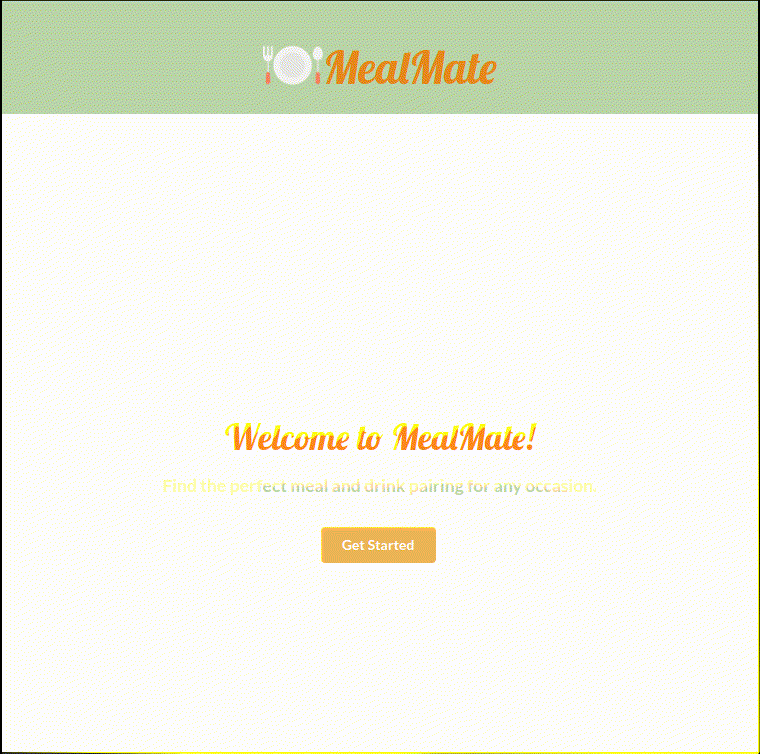

# MealMate

## Description
MealMate is a cocktail pairing application that seeks to solve the common problem of pairing foods with drinks. With MealMate, you could input any recipe in, it will search among a large database of recipes, and determine based on type what cocktail would best accompany it.
## Features

- Saves recent searches
- Displays a preview for both drink and meal during searches
- Displays details via a modal window

## Usage
Welcome Screen

Using the sidebar:

## Authors

- [@LCatSew](https://github.com/LCatSew)
- [@sethschnrt](https://github.com/sethschnrt)
- [@gcot970](https://www.github.com/gcot970)

## Acknowledgements
This application makes use of third-party libraries:

 ### Normalize.css
 Copyright © Nicolas Gallagher and Jonathan Neal

Permission is hereby granted, free of charge, to any person obtaining a copy of this software and associated documentation files (the "Software"), to deal in the Software without restriction, including without limitation the rights to use, copy, modify, merge, publish, distribute, sublicense, and/or sell copies of the Software, and to permit persons to whom the Software is furnished to do so, subject to the following conditions:

The above copyright notice and this permission notice shall be included in all copies or substantial portions of the Software.

THE SOFTWARE IS PROVIDED "AS IS", WITHOUT WARRANTY OF ANY KIND, EXPRESS OR IMPLIED, INCLUDING BUT NOT LIMITED TO THE WARRANTIES OF MERCHANTABILITY, FITNESS FOR A PARTICULAR PURPOSE AND NONINFRINGEMENT. IN NO EVENT SHALL THE AUTHORS OR COPYRIGHT HOLDERS BE LIABLE FOR ANY CLAIM, DAMAGES OR OTHER LIABILITY, WHETHER IN AN ACTION OF CONTRACT, TORT OR OTHERWISE, ARISING FROM, OUT OF OR IN CONNECTION WITH THE SOFTWARE OR THE USE OR OTHER DEALINGS IN THE SOFTWARE.

### Edamam API
[Link](https://www.edamam.com/terms/api/)

### TheCocktailDB API
[Link](https://www.thecocktaildb.com/)

### jQuery
[Link](https://tldrlegal.com/license/mit-license)

### Semantic UI
Permission is hereby granted, free of charge, to any person obtaining a copy of this software and associated documentation files (the 'Software'), to deal in the Software without restriction, including without limitation the rights to use, copy, modify, merge, publish, distribute, sublicense, and/or sell copies of the Software, and to permit persons to whom the Software is furnished to do so, subject to the following conditions:

The above copyright notice and this permission notice shall be included in all copies or substantial portions of the Software.

THE SOFTWARE IS PROVIDED 'AS IS', WITHOUT WARRANTY OF ANY KIND, EXPRESS OR IMPLIED, INCLUDING BUT NOT LIMITED TO THE WARRANTIES OF MERCHANTABILITY, FITNESS FOR A PARTICULAR PURPOSE AND NONINFRINGEMENT. IN NO EVENT SHALL THE AUTHORS OR COPYRIGHT HOLDERS BE LIABLE FOR ANY CLAIM, DAMAGES OR OTHER LIABILITY, WHETHER IN AN ACTION OF CONTRACT, TORT OR OTHERWISE, ARISING FROM, OUT OF OR IN CONNECTION WITH THE SOFTWARE OR THE USE OR OTHER DEALINGS IN THE SOFTWARE.

### Plate icons created by Freepik - Flaticon
https://www.flaticon.com/free-icons/plate

## License

[MIT](https://choosealicense.com/licenses/mit/)

